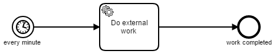
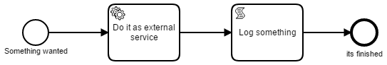

# External task worker scheduled by timer start event
This process applications contains a process to work on an external task.


## Show me the important parts!


## How does it work?

The [Java delegate class](src/main/java/com/camunda/consulting/external_task_worker_scheduled_by_process/ExternalWorkerDelegate.java) fetches a maximum of 5 task in each cycle and works on them in a loop. 

Here it calclates a random nomber between 0 and 5000 and sleeps for this number of milliseconds.

If the random number ends with 5, the task is released again to be picked up in the cycle.

If the random number ends with 7, the task failed and is marked with an incident immediately.

In all other cases, the random number is saved as a result of the task and the task is completed.

## How to use it?
Deploy the process application with maven like

```
mvn clean wildfly:deploy
```

or

```
mvn clean package
```

and copy the war-file into the deployment folder of your application server running the Camunda platform.

Once you deployed the application you can inspect it using
[Camunda Cockpit](http://docs.camunda.org/latest/guides/user-guide/#cockpit).

The folder `src/test/resources` includes a process with an external task. You can [deploy](https://docs.camunda.org/manual/7.8/reference/rest/deployment/post-deployment/) and [start instances](https://docs.camunda.org/manual/7.8/reference/rest/process-definition/post-start-process-instance/) of this process with the REST API.



## Environment
Built and tested against Camunda BPM version 7.8.0.

This project has been generated by the Maven archetype
[camunda-archetype-servlet-war-7.8.1](http://docs.camunda.org/latest/guides/user-guide/#process-applications-maven-project-templates-archetypes).


## License
[Apache License, Version 2.0](http://www.apache.org/licenses/LICENSE-2.0).

<!-- HTML snippet for index page
  <tr>
    <td></td>
    <td><a href="snippets/external-task-worker-scheduled-by-process">Camunda BPM Process Application</a></td>
    <td>A Process Application for [Camunda BPM](http://docs.camunda.org).</td>
  </tr>
-->
<!-- Tweet
New @CamundaBPM example: Camunda BPM Process Application - A Process Application for [Camunda BPM](http://docs.camunda.org). https://github.com/camunda/camunda-consulting/tree/master/snippets/external-task-worker-scheduled-by-process
-->